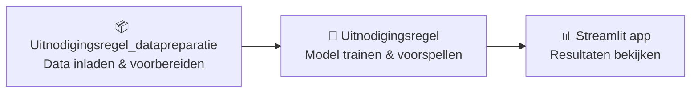

# Aan de slag

## Pipeline

De Uitnodigingsregel bestaat uit drie stappen:



## Wat heb je nodig

- Python-omgeving via [uv](https://docs.astral.sh/uv/getting-started/installation/)
- Toegang tot de [Uitnodigingsregel_datapreparatie](https://github.com/cedanl/Uitnodigingsregel_datapreparatie) repo voor datavoorbereiding
- Voorbereide data in `data/02-prepared/` (output van de datapreparatie-stap)
- De [data dictionary](Variabelen_Definities_v4.xlsx) voor een overzicht van alle variabelen

## Installatie

1. Clone de repository:

```
git clone https://github.com/cedanl/Uitnodigingsregel.git
cd Uitnodigingsregel
```

2. Installeer dependencies:

```
uv sync
```

## Gebruik

### Data kwaliteit controleren

```
uv run quarto render Model_analysis.qmd
```

### Voorspellingen genereren

```
uv run python main.py
```

### Streamlit app starten

```
uv run streamlit run app/main.py
```

## Projectstructuur

```
├── main.py                      <- Pipeline entrypoint
├── Model_analysis.qmd           <- Quarto analyse rapport
├── data/
│   ├── 01-raw/                  <- Brondata (gitignored, demo data committed)
│   ├── 02-prepared/             <- Output van datapreparatie-stap
│   └── 03-output/               <- Verwerkte datasets
├── models/predictions/          <- Gegenereerde voorspellingen
├── reports/                     <- Rapporten en figuren
├── src/uitnodigingsregel/       <- Installeerbaar Python package
├── app/                         <- Streamlit app
├── tests/                       <- Unit tests
└── docs/                        <- Deze documentatie
```
